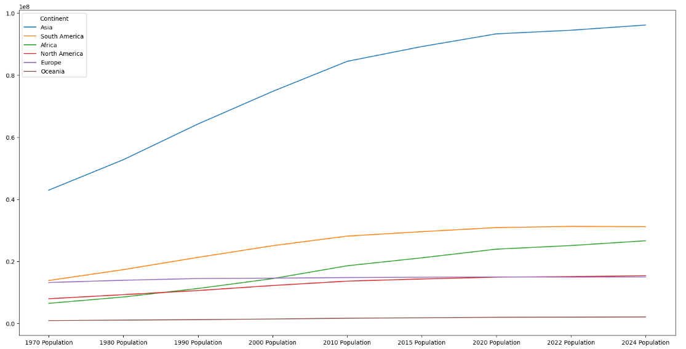
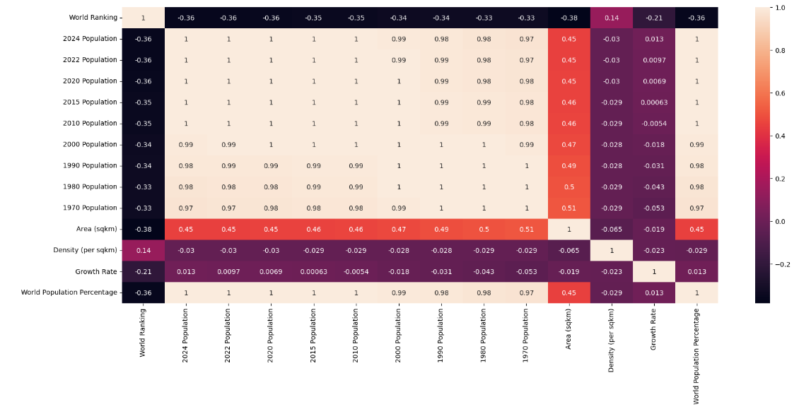

# Pandas-World-Population-EDA

Exploratory Data Analysis (EDA) on world population data (1970–2024) using Pandas. 
Visualizes population trends, growth by continent, and correlations between variables.

## Dataset
The analysis uses the [World Population Dataset 1970 – 2024 on Kaggle](https://www.kaggle.com/datasets/mayankgautam47/world-population-dataset-1970-2024).

## Features
- Inspect the dataset  
- Summarize key statistics and identify missing data  
- Group and aggregate population data by continent  
- Visualize trends with:
  - Line plots (population growth over years)  
  - Boxplots (distribution of numeric variables)  
  - Heatmaps (correlation between numeric columns)  
- Highlight continents with the fastest  population growth

## Example Visualizations

**Figure 1:** Population Growth by Continent (1970–2024)  

**Figure 2:** Correlation Heatmap 

